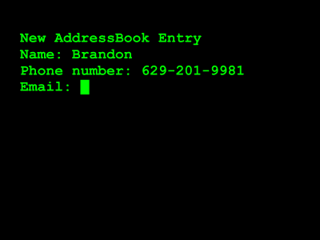

Address Book is my very first Ruby project, and it's written for the command line, without Rails. This project demonstrates the usefulness of Ruby as a records-driven solution. Though this project is small, Ruby is a preferred language for many development projects with a large database.

For this project, I also used Rspec for test-driven development. Address Book was built in July 2017.

***

### Requirements
My task was to build an address book for storing contacts and their information, with the user interacting with the command line terminal. I was given a specific menu of options to include, and I was to implement the functionality behind each of those menu choices.

Once the program starts, the menu is visible, along with a line of text declaring the number of contacts stored in the address book.

{:class="img-portfolio"}

By choosing option 2, a user can enter contact information into the address book program.

{:class="img-portfolio"}

The user is then taken back to the main menu, where they may choose to view all entries (1), view a specific entry by its order number (3), or search for an entry by name (4). When a contact is being viewed, the user is given four options: view the next entry in the array of entries (n), delete the current entry (d), edit the current entry (e), or return to the main menu (m).

{:class="img-portfolio"}

Back at the main menu, there is the option to upload a CSV file (5) and import multiple contacts at once, which is a very useful feature when dealing with large datasets. Another option that I added to the program "nukes" the entire address book (6), deleting all contact information. (I thought it might be helpful to confirm this command by the user to avoid accidental "nuking" of an address book.)

{:class="img-portfolio"}

### Nuke
The `nuke` method is a handy menu option for deleting all contacts in the user's address book program, leaving an empty array. The `main_menu` method contains the menu options and instructions for selections:


puts "Main Menu - #{address_book.entries.count} entries"
puts "1 - View all entries"
puts "2 - Create an entry"
puts "3 - View Entry Number n"
puts "4 - Search for an entry"
puts "5 - Import entries from a CSV"
puts "6 - Nuke the address book"
puts "7 - Exit"
print "Enter your selection: "


I then created a case statement that accepts the local variable `selection` as an integer:


selection = gets.to_i
case selection


When the user inputs the number 6, the terminal is cleared and the `nuke` method is run before the user ends up back at the main menu to perform other operations.


when 6
    system "clear"
    nuke
    main_menu


If the name of this method isn't very clear, `nuke` is a potentially dangerous process for the user to run; they could unintentionally lose all of their contacts by accidentally entering "6". Because of this, I added a confirmation prompt at the beginning of the method in order to confirm the deletion of ALL contacts in the program.


print "Are you sure you want to delete ALL entries? (Y/N) "
nuke_order = gets.chomp


If the user enters "Y" (case-insensitive), the address book entries are deleted and a message is returned confirming this action.


if nuke_order == "Y" || nuke_order == "y"
    address_book.entries.clear
    puts "The address book is now empty." if address_book.entries.empty?
    main_menu


This statement could also be written like this:


if nuke_order.downcase == "y"
    address_book = []
    puts "The address book is now empty." if address_book.entries.empty?
    main_menu


Entering "N" (case-insensitive) takes the user back to main menu.


elsif nuke_order == "N" || nuke_order == "n"
    puts "Whew! That was a close one."
    main_menu


### Conclusion
Ruby is a joy to write! I have really enjoyed learning Ruby and plan to build a lot more with this amazing development language. I love its speed and conciseness. (No missing semicolons throwing a bunch of errors!)

<a href="https://github.com/capncapes/address-book/tree/master" target="_blank">You can see this project on GitHub.</a>