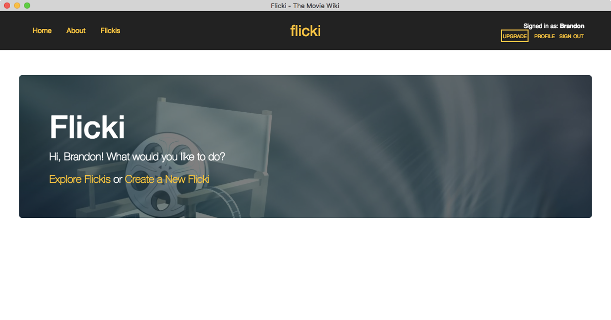
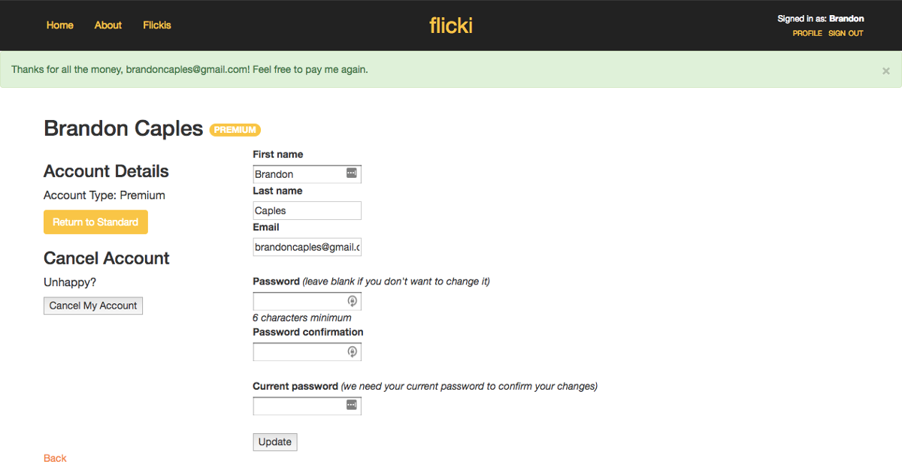

Flicki ("the movie wiki") is a wiki application for publicly creating and updating basic movie information. The concept of this application probably isn't very useful, but the purpose of this project is to practice my Rails skills, particularly as they relate to offering premium content and charging for it using a Stripe integration. This web app also marks my first use of the Devise gem for managing user data, as well as the Redcarpet gem for parsing markdown.

***

### Requirements
I set out to build a wiki app that can be edited by any logged in user and that allows users the option to upgrade to private wikis with a Stripe payment.

{:class="img-portfolio"}

### Devise
One of my favorite gems is Devise, which manages user capabilities expertly. As complex as Devise is, it's very simple to use. After adding `gem 'devise'` to the Gemfile and installing it, run `rails g devise:install` to add it to the application. Here's what the `User` model looks like:


class User < ApplicationRecord
    # Include default devise modules. Others available are:
    # :confirmable, :lockable, :timeoutable and :omniauthable
    devise :database_authenticatable, :registerable,
           :recoverable, :rememberable, :trackable, :validatable
end


### Stripe
Flicki uses Stripe to accept payments and upgrade users to premium accounts. I was impressed with the simplicity of connecting to Stripe for secure payments. Inside the `ChargesController`, a customer and a charge get created with each transaction, followed by `current_user.premium!` to upgrade the user to premium.


class ChargesController < ApplicationController
    before_action :amount

    def new
        @stripe_btn_data = {
            key: "#{ Rails.configuration.stripe[:publishable_key] }",
            description: "Flicki Membership - #{current_user.first_name} #{current_user.last_name}",
            amount: @amount
        }
    end

    def create
        customer = Stripe::Customer.create(
            email: current_user.email,
            card: params[:stripeToken]
        )

        charge = Stripe::Charge.create(
            customer: customer.id,
            amount: @amount,
            description: "Flicki Membership - #{current_user.email}",
            currency: 'usd'
        )

        current_user.premium!
        flash[:notice] = "Thanks for all the money, #{current_user.email}! Feel free to pay me again."
        redirect_to edit_user_registration_path(current_user)
     
    rescue Stripe::CardError => e
        flash[:alert] = e.message
        redirect_to new_charge_path
    end

    private

    def amount
        @amount = 1500
    end
end


The user is then redirected to their account page where they can see their account status and opt to downgrade from premium.

{:class="img-portfolio"}

### Redcarpet
Redcarpet manages markdown in Rails apps, so Flicki employs it. The meat of this gem is found in the `ApplicationHelper`, where options and extensions can be customized to fit the application's needs.


module ApplicationHelper
    def markdown(text)
        options = {
            filter_html: true,
            hard_wrap: true,
            safe_links_only: true,
            link_attributes: { rel: 'nofollow', target: "_blank" },
            no_images: true
        }

        extensions = {
            autolink: true,
            superscript: true,
            disable_indented_code_blocks: true,
            tables: true,
            footnotes: true
        }

        renderer = Redcarpet::Render::HTML.new(options)
        markdown = Redcarpet::Markdown.new(Redcarpet::Render::HTML, extensions)

        markdown.render(text).html_safe
    end
end


### Conclusion
Flicki was fun to develop. Not only do I love the simplicity and ease of using Ruby [on Rails], but resources like the Devise and Redcarpet gems and the Stripe API make building incredible web apps quick, easy, and intuitive.

<a href="https://dry-inlet-64305.herokuapp.com/" target="_blank">Click here to see this project live!</a>