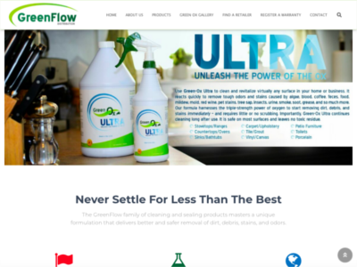
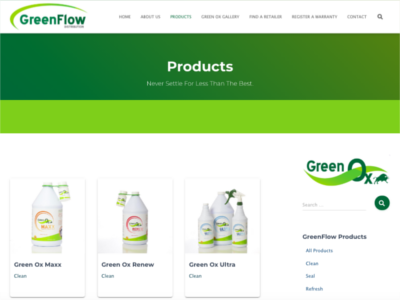
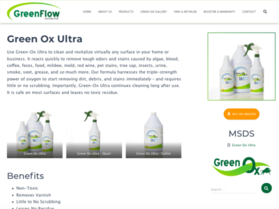

I built a child WordPress theme on top of the <a href="https://themeisle.com/themes/hestia-pro/?ref=caples">Hestia</a> theme for a chemical products client to showcase products. Interestingly, the client requested that products not be purchasable through the website. Exceptions were to be directed to Amazon. I converted an existing website from Shopify, where products were being sold online, to WordPress as a brochure site. The two areas of focus for this project were a refreshed, modern look and search engine optimization.

{:class="img-portfolio"}

***

### Requirements
GreenFlow Distribution asked for a WordPress conversion from Shopify. They needed the new site to look modern and attractive, and they requested that blog posts be removed. (The company no longer maintains a blog.) They also asked that the website no longer process transactions. Instead, small orders of select products were to be directed to Amazon. Because of the nature and scope of the business, large orders were to be directed to a staff member.

{:class="img-portfolio"}

I created a custom post type for products that included information like product numbers, prices, product images, a link to Amazon, etc.

{:class="img-portfolio"}

### Conclusion
GreenFlow Distribution was happy with the new look and functionality.

<a href="https://greenflowusa.com/?ref=caples" target="_blank">View this project in production.</a>